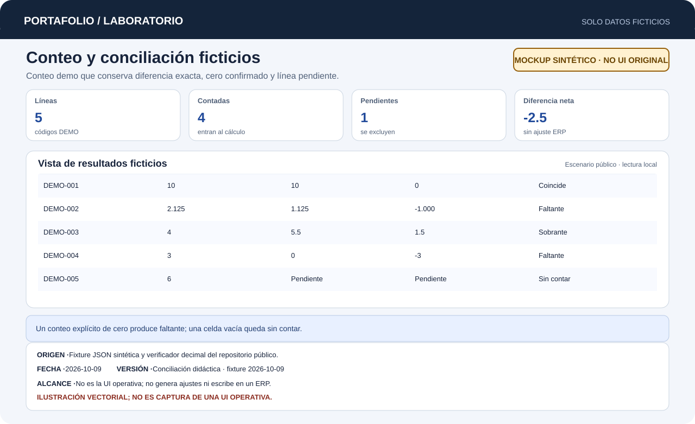

# Inventario Físico

Importación de existencias, registro de conteos físicos y conciliación trazable por almacén.

> [!NOTE]
> **Repositorio documental.** El código operativo permanece privado en su propio repositorio. Aquí se publican documentación de arquitectura, evidencia técnica, un mockup sintético del conteo y un ejemplo reproducible con datos ficticios.

[Probar el ejemplo](#probar-el-ejemplo) · [Caso de estudio](docs/case-study.md) · [Arquitectura](docs/architecture.md) · [Verificación y límites](docs/verification.md)

[Abrir demo interactiva](demo/index.html) · [Ampliar mockup sintético](docs/images/mockup-synthetic.svg)

## Problema

Al auditar existencias en almacenes, las hojas de cálculo compartidas o impresas presentan riesgos críticos:
- Confundir una partida **pendiente de conteo** con una existencia real de **cero**.
- Sobrescribir conteos entre auditores simultáneos sin control de concurrencia.
- Errores de redondeo en partidas con cantidades decimales o fraccionadas.
- Falta de historial para identificar quién registró o modificó cada partida.

## Solución

Una plataforma web con flujo estructurado: **Subir reporte → Contar → Ver resumen**.
- Permite importar reportes Excel con vista previa y validación de incidencias.
- Controla el acceso y asignación por almacén verificado en el servidor.
- Proporciona una interfaz ágil de conteo con búsqueda, filtros, control de versión esperada por partida y registro de auditoría.
- Genera un resumen analítico de diferencias para conciliación externa previa al ajuste en el ERP.



El mockup y la demo usan cinco líneas inventadas. Un conteo cero participa como valor confirmado; una línea vacía queda pendiente y fuera de la diferencia neta.

*Material visual de referencia del repositorio. Este ejemplo no verifica su origen ni acredita el flujo de la aplicación.*

## Aportación personal

Definí la lógica de conciliación distinguiendo partidas pendientes de cero confirmado a partir de las necesidades reales observadas en almacén. Participé en el desarrollo de la interfaz de usuario con React y de la API con ASP.NET Core mediante un enfoque de desarrollo guiado, implementando el control de versiones por partida y el cálculo de diferencias para conciliar con el ERP.

## Tratamiento de cero, pendientes y diferencias

Para garantizar la integridad en la conciliación, el sistema aplica reglas estrictas de negocio:

| Estado | Definición y tratamiento | Impacto en conciliación |
|---|---|---|
| **Pendiente** (`null`) | La partida aún no ha sido revisada en el almacén. Se excluye del cálculo de diferencias para no falsear el inventario. | No genera ajuste; queda marcada como pendiente de auditar. |
| **Cero** (`0`) | El auditor verificó físicamente el estante y confirmó la ausencia total del producto. | Si el sistema esperaba existencias, genera un **Faltante** formal por el total esperado. |
| **Coincidencia** | Cantidad física coincide exactamente con la cantidad teórica esperada. | Diferencia = 0. Sin necesidad de ajuste. |
| **Faltante / Sobrante** | Discrepancia cuantificada (`físico − esperado`) con precisión decimal exacta. | Se documenta la diferencia neta y porcentaje para justificación y conciliación. |

## Probar el ejemplo

Requiere Python 3 y biblioteca estándar. Desde la raíz del repositorio:

```text
python examples/verify.py
```

Procesa cinco líneas ficticias de un conteo y muestra esperado, físico, diferencia y estado. Distingue cero confirmado de pendiente: cuatro líneas entran en la conciliación, una queda excluida y la diferencia neta de las contadas es `-2.5` unidades. No crea ajustes en el ERP.

## Resultados comprobados

- **Conteo y conciliación reproducibles:** salida por línea para coincidente, faltante, sobrante, cero confirmado y pendiente; pendientes excluidas del total de diferencias.
- **Comparación de cantidades y diferencias exactas:** cálculo con tipos decimales precisos sin pérdida por punto flotante.
- **Evidencia histórica:** 16 casos de prueba sintéticos Playwright aprobados en el informe previo de interfaz (diez funcionales y seis de regresión visual responsive).
- **Control de concurrencia:** validación de versión esperada por partida para prevenir sobreescrituras accidentales en operaciones de almacén.

No se inventan métricas de ahorro de horas de auditoría ni capacidad volumétrica.

## Tecnologías

| Alcance | Tecnologías |
|---|---|
| Observadas en la fuente | React, TypeScript, Vite, ASP.NET Core .NET 10, Entity Framework Core, PostgreSQL, Npgsql, ClosedXML, Playwright |
| Ejemplo público | Python 3 (biblioteca estándar) |
| Piloto documentado | Entorno piloto en Render / Supabase (no intervenido durante esta publicación) |

## Límites

- El código operativo completo y su base de datos son privados y no se distribuyen en este repositorio.
- Las pruebas Playwright corresponden a evidencia histórica documentada; no se reejecutaron en esta fase documental.
- Recuperación remota ante fallos, concurrencia masiva y pruebas en dispositivos físicos dedicados (scanners de almacén) quedan como pendientes técnicos.
- La aplicación no modifica directamente el ERP corporativo; entrega un resumen estructurado para conciliación autorizada.

Detalle técnico y condiciones pendientes: [verificación y límites](docs/verification.md).

## Licencia

Pendiente de decisión expresa. No se asigna licencia ni derechos sobre el código privado.
