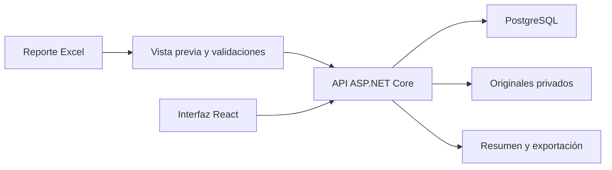

# Arquitectura observada

React y API comparten origen HTTPS. El navegador no accede directamente a PostgreSQL. Core contiene entidades y reglas; Infrastructure implementa persistencia, importación y migraciones; Api comprueba identidad y alcance por almacén.

El recorrido directo se implementa en SimpleCounts. Conserva un total vigente por artículo, revisiones y operaciones idempotentes. El servidor comprueba versión esperada y serializa escrituras críticas mediante transacciones. Esto no acredita capacidad medida bajo carga.

El importador revisa estructura y cantidades del Excel. La vista previa permite identificar incidencias y decidir exclusiones sin corregir silenciosamente el original. Originales, secretos, certificados, claves de sesión y respaldos son privados.

La documentación revisada describe proveedores local/Supabase para originales y persistencia cifrada de claves de sesión. La revisión del portafolio no ejecuta migraciones ni consulta bases remotas.
